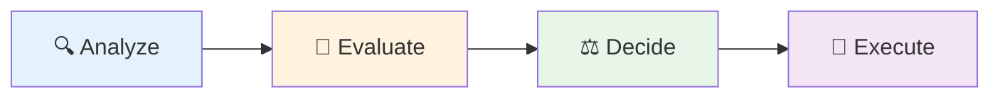

# Demo roadmap

## The pattern to observe

**AI proposes → Human validates → AI executes**

### Why this pattern?

- Leverages AI speed without sacrificing control
- Reduces cognitive load: AI explores, you decide
- Scalable: adaptable from individual code to complex systems

