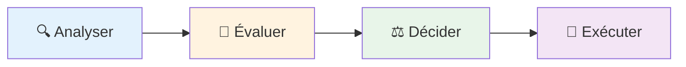

# Roadmap des démonstrations

## Le pattern à observer

**L'IA propose → L'humain valide → L'IA exécute**

### Pourquoi ce pattern ?

- Tire parti de la vitesse de l'IA sans sacrifier le contrôle
- Réduit la charge cognitive : l'IA explore, vous décidez
- Scalable : adaptable du code individuel aux systèmes complexes

